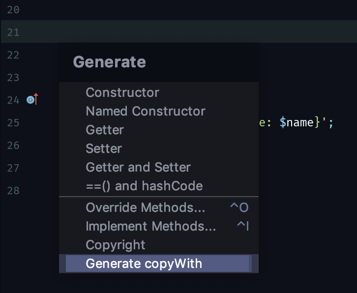

# Dart copyWith plugin

Generates a `copyWith` implementation for Dart classes in IntelliJ / Android Studio.

Instructions:

- Position the cursor where you want to insert the  `copyWith` method.

- Press CMD+N / CTRL+N to show the generate dialog (Alternatively, right click in the editor and select "Generate...")



- Select the "copyWith" menu item.

### Example:

Given the class:

```dart
class Book {
    final String id;
    final String name;
    final String description;
    final String author;
    
    // ... methods ...
}
```

The plugin will generate the following `copyWith` method:

```dart
Book copyWith({String id, String name, String description, Author author}) {
    return Book(
        id: id ?? this.id,
        name: name ?? this.name,
        description: description ?? this.description,
        author: author ?? this.author,
    );
}
```

### Current limitations:

Most of these are not an issue if you're following Dart's coding conventions. Mentioned for completeness:

- The fields have to be listed directly below the class declaration (new lines are allowed). So for example, if you have field declarations below method declarations, they will not be included.
- Only one field per line! This, for example, will not be parsed: `final String foo; final String bar;`
- Fields with a default value will not be included. E.g. `String foo = "hello"`.
- If there are multiple classes per file, it works only for the first one.

### Contribute:

- The logic to generate the method string is in [CopyWithMethodGenerator.kt](https://github.com/i-schuetz/dart_copy_with_plugin/blob/master/src/main/kotlin/action/CopyWithMethodGenerator.kt). You don't need any plugin knowledge to modify its behavior. To contribute:
1. Fork
2. Commit changes to a branch in your fork
3. Push your code and make a pull request
    
Adding some unit tests for [CopyWithMethodGenerator.kt](https://github.com/i-schuetz/dart_copy_with_plugin/blob/master/src/main/kotlin/action/CopyWithMethodGenerator.kt) would be great, in particular to be able to test without having to touch anything plugin related.

### Outlook:

The parsing definitely could be smarter, to generate something similar to an AST, perhaps. For now the parsing is very simple and regex based. This is probably enough for this small plugin though.
